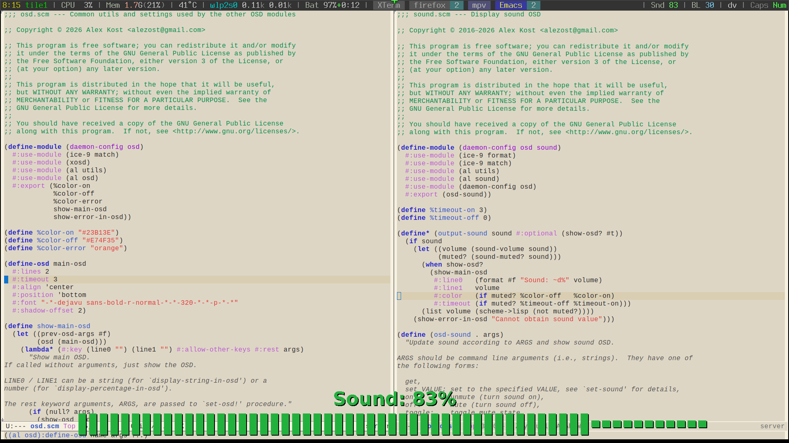

* About

This is my configuration for [[https://github.com/alezost/guile-daemon][Guile-Daemon]].  Mainly, I use it as an OSD
daemon, i.e. to display something (sound volume, display brightness,
clock, etc.) on screen using [[https://github.com/alezost/guile-xosd][Guile-XOSD]].

*Note:* along with =(xosd)= module from Guile-XOSD, [[https://github.com/alezost/guile-config][my guile modules]] are
used in this config (they have =(al ...)= form).

* Files

- [[file:init.scm]] is the "config" file itself (it is symlinked to
  [[file:$XDG_CONFIG_HOME/guile-daemon/init.scm]]).  All this file does is:
  it adds [[file:modules]] directory (see below) to the Guile =%load-path=,
  and loads =(daemon-config)= module.

- [[file:modules]] directory contains several modules with the code I use
  for Guile-Daemon.  I split the code into several modules to make
  "logical pieces", but more importantly to speed-up the start of
  Guile-Daemon, as these modules are loaded *on demand*: only
  =(daemon-config)= is loaded on start-up, and it's just a wrapper that
  autoloads procedures placed in the other modules.

  So, for example, =(daemon-config osd sound)= module is loaded only
  when =osd-sound= procedure is called, i.e., when I press one of my
  sound keys (bound to =osd-sound ...= — see below) first time.

- [[file:scripts]] directory contains a couple of shell scripts that send
  expressions to the Guile Daemon using =gdpipe= (it is a part of
  Guile-Daemon).  This directory is placed in my $PATH so I can use such
  commands as:

  #+begin_src sh
  osd-sound set +10
  osd-backlight set -3
  osd-text hello
  osd-clock
  #+end_src

  For example, I bind several keys to =osd-sound= and =osd-backlight=
  commands in my [[https://github.com/alezost/stumpwm-config][stumpwm config]].  The result may be seen in the gif demo
  above.
